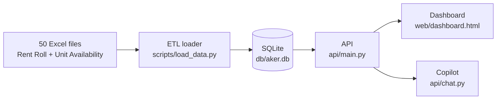

# Aker AI — Round 2 Case Study

### [**aker-ai-terminal.onrender.com**](https://aker-ai-terminal.onrender.com)

Free tier, so the first load after a while can take ~30s to wake up. Everything on it
is real: a relational schema, an ETL loader, an API, a dashboard, and a tool-calling
chatbot, all built on top of 50 actual Excel exports (25 properties' worth of rent
rolls and unit availability reports).

## The assignment

1. Design a relational database schema to store as much data as possible from the Excel files.
2. Develop a Python script to process all the files and load the data into the database.
3. Build a presentation layer (dashboard, LLM chatbot, or something else) that showcases skills.

## Start here: [How it's built](https://aker-ai-terminal.onrender.com/how-it-works.html)

That page is the real walkthrough, not this file — the schema, the pipeline stage by
stage, the live test suite output, and every data quality issue actually caught,
pulled straight from `/anomalies` rather than written up after the fact. The short
version:



Fifteen properties came out of the 25 source files once duplicates and program
variants (residential/affordable/commercial) resolved to the same physical building.
A handful of those files had real gaps in them (missing charge data, impossible
dates, a stale unit availability snapshot) — those are flagged automatically at load
time, not smoothed over.

## Navigating the repo

| Path | What's there |
|---|---|
| `db/schema.sql` | The schema itself: properties → units → tenancies → charges, snapshot-based so a second month of data is purely additive. |
| `scripts/load_data.py`, `scripts/etl/` | The loader. Parsing is separated from DB writes; identity comes from filename regex, not a hardcoded property list; charge totals are re-validated live as it loads. |
| `api/main.py` | The read endpoints — narrow and single-purpose, doubling as the chatbot's tool definitions so the dashboard and the copilot read through the exact same code path. |
| `api/chat.py` | The chatbot's tool-calling agent loop over the Claude API, plus the grounding check that verifies every number it states against a real tool result. |
| `web/` | The frontend: `dashboard.html`, `copilot.html`, `how-it-works.html`, all vanilla JS/CSS. |
| `tests/` | 54 tests — idempotency, known-good row counts, and regression coverage for every real bug found along the way. Run with `pytest tests/ -v`. |
| `CLAUDE.md` | The full build log, phase by phase, in the order it actually happened — goal, what was done, what was found. |

## Running it locally

```bash
pip install -r requirements.txt
python3 scripts/load_data.py        # builds db/aker.db from the source Excel files
uvicorn api.main:app --reload       # serves the API + the frontend on :8000
```

The chatbot needs a real Anthropic API key. Drop `ANTHROPIC_API_KEY=your-key-here`
into a `.env` file at the project root (gitignored). Everything else works without it.

```bash
pytest tests/ -v   # 54 tests, no API key needed
```
