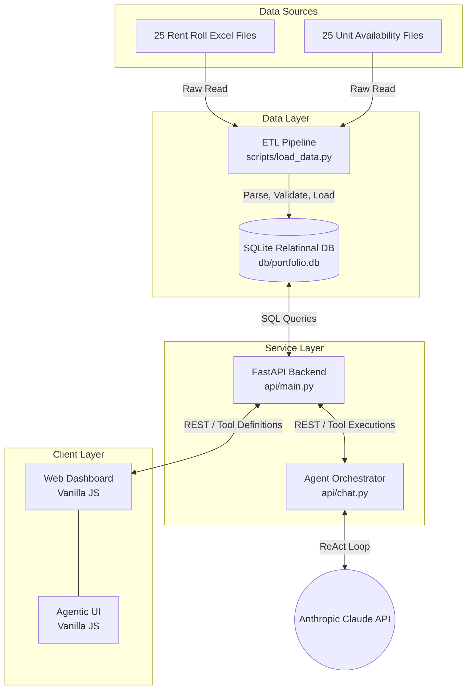
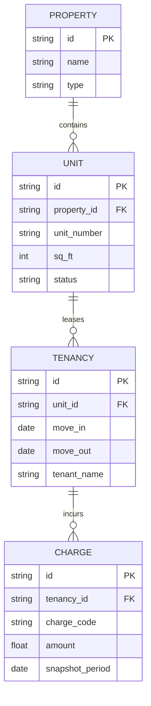
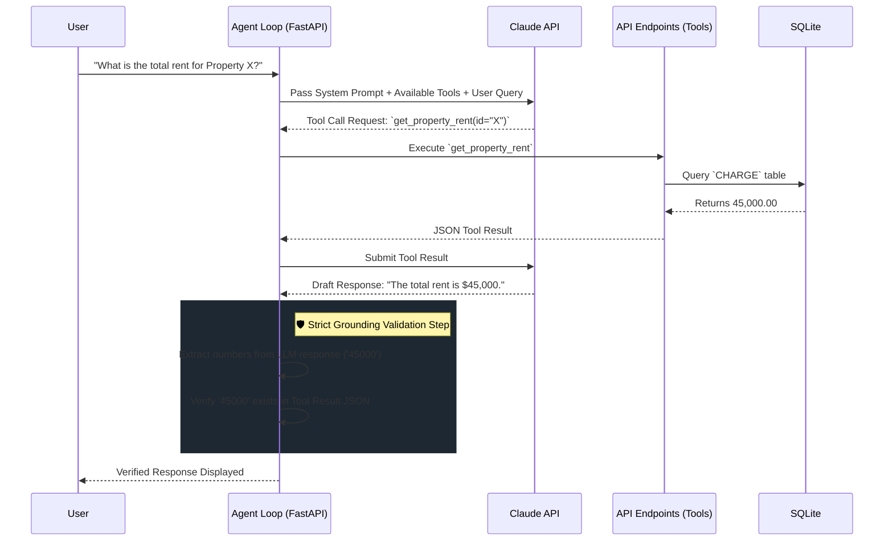

# Agentic Terminal

   

### [**aker-ai-terminal.onrender.com**](https://aker-ai-terminal.onrender.com)
*(Running on a free Render tier — initial cold start may take ~30s).*

Agentic Terminal is an end-to-end data engineering and LLM orchestration project built as a hardcore sandbox to push AI tool-calling capabilities to their absolute limit. 

Rather than relying on sterile, synthetic datasets, this system is built on top of a messy, real-world data swamp: **50 highly unstructured Excel exports** (25 properties' worth of rent rolls and unit availability reports). What began as an exercise in schema design evolved into a relentless stress-test for autonomous agents. By engineering a resilient ETL pipeline, a rigid relational database, and strict API boundaries, this project forces the LLM to ground its reasoning in actual, un-smoothed data anomalies, completely mitigating hallucination.

---

## 🏗️ System Architecture

The stack is designed with strict separation of concerns, moving from unstructured chaos to deterministic API endpoints, which ultimately serve both human interfaces and AI agents.


```mermaid
flowchart TD
    subgraph Data Sources
        E1[25 Rent Roll Excel Files]
        E2[25 Unit Availability Files]
    end

    subgraph Data Layer
        ETL[ETL Pipeline\nscripts/load_data.py]
        DB[(SQLite Relational DB\ndb/portfolio.db)]
    end

    subgraph Service Layer
        API[FastAPI Backend\napi/main.py]
        Agent[Agent Orchestrator\napi/chat.py]
    end

    subgraph Client Layer
        Dash[Web Dashboard\nVanilla JS]
        Copilot[Agentic UI\nVanilla JS]
    end

    E1 -->|Raw Read| ETL
    E2 -->|Raw Read| ETL
    ETL -->|Parse, Validate, Load| DB
    DB <-->|SQL Queries| API
    
    API <-->|REST / Tool Definitions| Dash
    API <-->|REST / Tool Executions| Agent
    
    Agent <-->|ReAct Loop| LLM((Anthropic Claude API))
    
    Dash --- Copilot
```

---

## ⚙️ Core Technical Components

### 1. The ETL Engine & Anomaly Detection
The pipeline doesn't just copy data; it actively parses, normalizes, and interrogates it. Identity resolution relies on sophisticated filename regex parsing rather than hardcoded mapping. 

During ingestion, the loader performs live re-validation of charge totals. Impossible dates, missing financial records, and duplicated properties hiding across differently-named files are intentionally *not* smoothed over. Instead, they are caught and flagged into an `/anomalies` endpoint, providing the LLM with genuine data quality problems to analyze.

### 2. Snapshot-Based Relational Schema
The database is designed to handle temporal property management data safely. It utilizes a snapshot-based architecture, meaning ingesting a second month of data is purely additive, preserving historical states without mutating past records.


```mermaid
erDiagram
    PROPERTY ||--o{ UNIT : contains
    PROPERTY {
        string id PK
        string name
        string type
    }
    UNIT ||--o{ TENANCY : leases
    UNIT {
        string id PK
        string property_id FK
        string unit_number
        int sq_ft
        string status
    }
    TENANCY ||--o{ CHARGE : incurs
    TENANCY {
        string id PK
        string unit_id FK
        date move_in
        date move_out
        string tenant_name
    }
    CHARGE {
        string id PK
        string tenancy_id FK
        string charge_code
        float amount
        date snapshot_period
    }
```

### 3. Agentic Loop & Strict Grounding
The most critical feature of the chatbot (`api/chat.py`) is its anti-hallucination architecture. The LLM does not have direct SQL access; instead, it is restricted to the exact same read-only, single-purpose REST endpoints used by the dashboard. 

Furthermore, a strict **Grounding Check** middleware intersects the LLM's final response. Before returning text to the user, the system verifies that every numeric value stated by the agent exists within the exact payload returned by the tools it invoked during that turn.


```mermaid
sequenceDiagram
    participant User
    participant Agent as Agent Loop (FastAPI)
    participant LLM as Claude API
    participant Tools as API Endpoints (Tools)
    participant DB as SQLite

    User->>Agent: "What is the total rent for Property X?"
    Agent->>LLM: Pass System Prompt + Available Tools + User Query
    LLM-->>Agent: Tool Call Request: `get_property_rent(id="X")`
    Agent->>Tools: Execute `get_property_rent`
    Tools->>DB: Query `CHARGE` table
    DB-->>Tools: Returns 45,000.00
    Tools-->>Agent: JSON Tool Result
    Agent->>LLM: Submit Tool Result
    LLM-->>Agent: Draft Response: "The total rent is $45,000."
    
    rect rgb(30, 40, 50)
        Note right of Agent: 🛡️ Strict Grounding Validation Step
        Agent->>Agent: Extract numbers from LLM response ('45000')
        Agent->>Agent: Verify '45000' exists in Tool Result JSON
    end
    
    Agent-->>User: Verified Response Displayed
```

---

## 🗂️ Project Structure

| Directory / File | Description |
| :--- | :--- |
| `db/schema.sql` | The DDL defining the core architecture: properties → units → tenancies → charges. Designed for additive, snapshot-based monthly loading. |
| `scripts/load_data.py` | The main entry point for the ETL pipeline. |
| `scripts/etl/` | Modularized parsing logic. Separates I/O from validation and DB writes. |
| `api/main.py` | FastAPI application. Serves strictly-typed read endpoints that double as JSON Schema tool definitions for the agent. |
| `api/chat.py` | The agent orchestrator. Manages the ReAct loop, tool execution context, and the numerical grounding validation logic. |
| `web/` | Vanilla JS, CSS, and HTML for the Presentation Layer (`dashboard.html`, `copilot.html`). Zero build steps. |
| `tests/` | 54 automated tests using `pytest`. Covers ETL idempotency, expected row counts, and regression tests for edge cases discovered in the wild. |

---

## 🚀 Getting Started

### Local Development Setup

Clone the repository and install the dependencies. It is highly recommended to use a virtual environment.

```bash
# 1. Install dependencies
pip install -r requirements.txt

# 2. Run the ETL Pipeline
# This parses the raw Excel files and builds db/portfolio.db from scratch
python3 scripts/load_data.py

# 3. Spin up the API and Frontend
uvicorn api.main:app --reload
```
The application will now be serving the API and the frontend interfaces at `http://127.0.0.1:8000`.

### Agent Configuration (Optional)
The dashboard and standard API function perfectly offline. However, to enable the Copilot chatbot, you must provide a valid Anthropic API key.

Create a `.env` file at the root of the project (this is gitignored) and add your key:
```env
ANTHROPIC_API_KEY=sk-ant-your-api-key-here
```

### Running the Test Suite
The project maintains rigorous test coverage to ensure data pipeline stability. The test suite operates without requiring an API key.

```bash
# Run all 54 tests with verbose output
pytest tests/ -v
```
